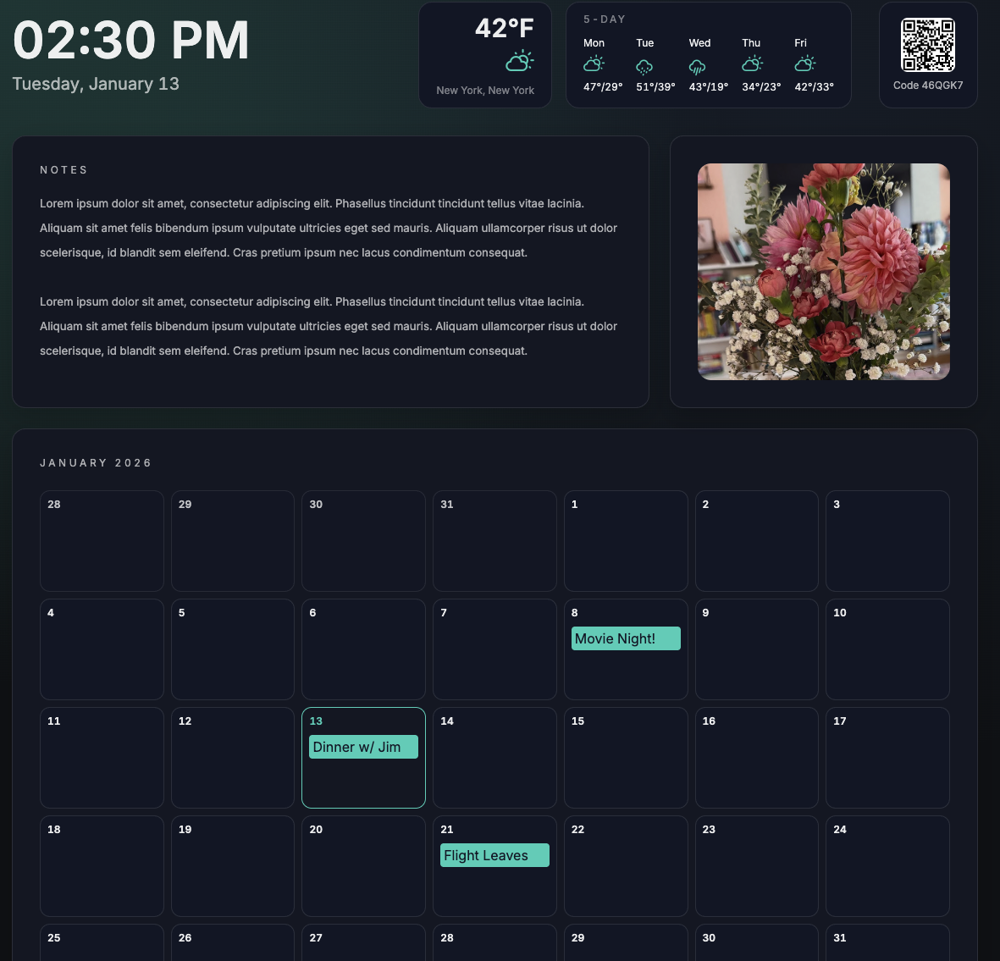

# Hearth

Hearth is a local-first, LAN-only family dashboard built for a TV browser. It runs on an always-on device and gives you a big-screen `/display` view plus a mobile-first `/control` view.



## Features

- Local-first, LAN-only with a simple pairing code
- `/display` read-only TV layout with calendar, photos, weather, and family note
- `/control` mobile admin UI for modules, theme, and events
- Live updates via Server-Sent Events (SSE)
- Persistent SQLite storage
- Dark + Light "Hearth Matte" themes

## Quickstart (Docker)

```bash
docker compose up --build
```

Open:
- Display: `http://<host>:8787/display` (enter the pairing code shown in `/control`)
- Control: `http://<host>:8787/control`

On first boot, the server prints the pairing code and display device ID in the logs.

## Display Pairing

Open `/display` on your TV and enter the pairing code shown in `/control` → General → Display. The display stores the device ID locally after pairing, so you only need to enter the code once per browser/device.

## Development

```bash
pnpm install
pnpm dev
```

This starts:
- Fastify API server on `http://localhost:8787`
- Vite display app on `http://localhost:5173`
- Vite control app on `http://localhost:5174`

## Production (No Docker)

```bash
pnpm install
pnpm build
pnpm --filter @hearth/server start
```

Then open:
- Display: `http://<host>:8787/display` (enter the pairing code shown in `/control`)
- Control: `http://<host>:8787/control`

## Environment

Copy `.env.example` to `.env` if you want to customize ports or data paths.

Key values:
- `PORT` (default `8787`)
- `HOST` (default `0.0.0.0`)
- `DATA_PATH` (default `/data/hearth.db` in Docker)
- `TOKEN_SECRET` (optional; signing key for control tokens; auto-generated if empty)
- `GOOGLE_PHOTOS_CLIENT_ID` (optional, for Google Photos)
- `GOOGLE_PHOTOS_CLIENT_SECRET`
- `GOOGLE_PHOTOS_REDIRECT_URI` (default `http://localhost:8787/api/control/photos/google/callback`)
- `GOOGLE_PHOTOS_CACHE_DIR` (default `/data/google-cache`)
- `DEV_CONTROL_ORIGIN` (optional; dev-only redirect target after Google OAuth, e.g. `http://localhost:5174/control/`)
- `LAN_IP` (optional; override LAN IP for QR URLs)
- `THEME_ASSETS_DIR` (default `/data/theme`)

## Google Photos (optional)

Hearth uses the **Google Photos Picker API** (service name: `picker.googleapis.com`) to select photos. You must enable the Picker API (not the deprecated Photos Library API).

1) Create a Google Cloud project
2) Enable **Google Photos Picker API** (`picker.googleapis.com`)
3) Configure an OAuth consent screen
4) Create an OAuth Client ID (Web application)
5) Add the authorized redirect URI:

```
http://localhost:8787/api/control/photos/google/callback
```

Then add the credentials to `.env`:

```
GOOGLE_PHOTOS_CLIENT_ID=...
GOOGLE_PHOTOS_CLIENT_SECRET=...
GOOGLE_PHOTOS_REDIRECT_URI=http://localhost:8787/api/control/photos/google/callback
```

Required scope (configured automatically by Hearth during OAuth):
`https://www.googleapis.com/auth/photospicker.mediaitems.readonly`

Complete the auth flow from the host machine itself (not a phone) so Google can redirect to localhost. Google blocks private IP redirect URIs over HTTP, so `localhost` is the simplest local option. Once connected, use `/control` → Photos → Choose photos to open the picker.

If you see a 403 with \"insufficient authentication scopes\", revoke the Hearth app at https://myaccount.google.com/permissions and reconnect to grant the Picker scope.

Google Photos are cached locally on the server to avoid expired links. Cached files live under `GOOGLE_PHOTOS_CACHE_DIR` (default `/data/google-cache`). URLs served by Hearth are relative (e.g. `/api/photos/cache?...`) and resolve based on the host you use to open `/display`.

## Local Photos (optional)

You can point Hearth at a local folder on the server to use offline photos.

1) Create a folder on the host, e.g. `./data/photos`
2) Mount it into the container (already included in `docker-compose.yml`):

```
./data/photos:/data/photos
```

3) In `/control` → Photos → Local Photos, set the directory to `/data/photos`
4) Click **Save & Scan**

You can enable both Google Photos and Local Photos. Hearth will mix them and (optionally) shuffle the slideshow in `/control` → Photos. You can also choose 1-4 photo tiles per row for the Photos module.

## Endpoints

- `GET /api/state` - public state for display
- `GET /api/display/:deviceId/events` - SSE stream
- `POST /api/control/pair` - pairing code → token
- `POST /api/control/state` - update state (auth)
- `POST /api/control/modules/toggle` - toggle modules (auth)
- `POST /api/control/layout` - update layout (auth)

## Layout

- Layout supports 4 columns with spans 1-4 per module.
- Photos and Calendar heights are configurable in `/control` → Layout (px slider + Auto).
- Notes can be shown/hidden from `/control` → Notes.

## Themes

Hearth supports Dark, Light, and Custom themes. Use `/control` → General → Theme → Custom to edit colors and apply them to both display and control.

Custom themes support an optional background image. Upload it from the Custom theme modal; the server stores it under `THEME_ASSETS_DIR` (default `/data/theme`).
apps/
  display/    # TV UI
  control/    # Mobile admin UI
packages/
  shared/     # Types + schemas
  ui/         # Shared UI components + theme
server/       # Fastify + SQLite + SSE
```

## License

MIT
